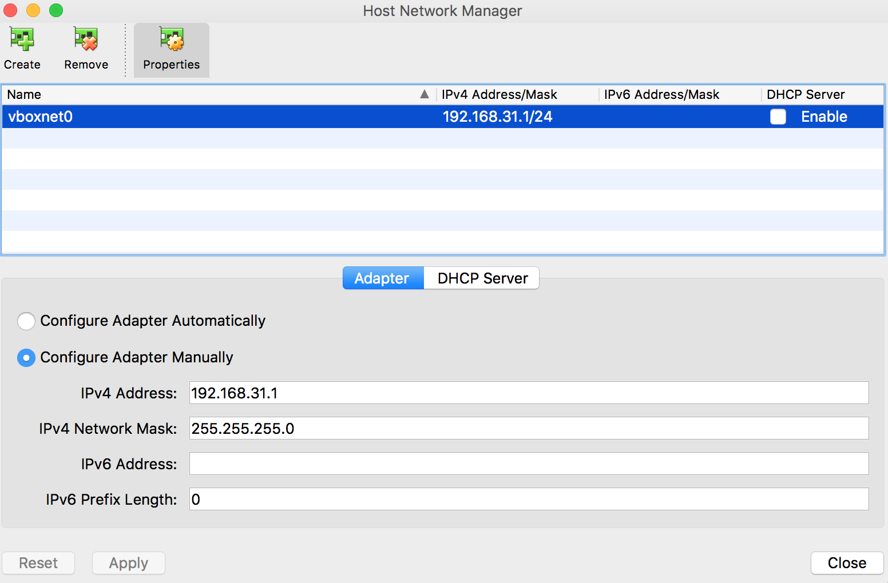

## Connect Host and Guest to enable SSH

Valid for VirtualBox 5.2 and higher.

Under VirtualBox:

1. Open _File > Host Network Manager..._
2. Create/Upddate `vboxnet0`, and **disable DHCP**:



On guest Ubuntu VM:

1. Check interface name:

```sh
ifconfig -a
```
    Get the name of the interface with no IP set (e.g. `enp0s8`).
1. Edit interfaces file `/etc/network/interfaces`:

```sh
sudo vi /etc/network/interfaces
```
2. Add the following lines to the end of the file:

```
# The Host-Only network interface
auto enp0s8
iface enp0s8 inet static
address 192.168.56.10
netmask 255.255.255.0
```
3. Start the network card (or reboot with `sudo shutdown -r`):

```sh
sudo apt-get install ifupdown
sudo ifup enp0s8
```
